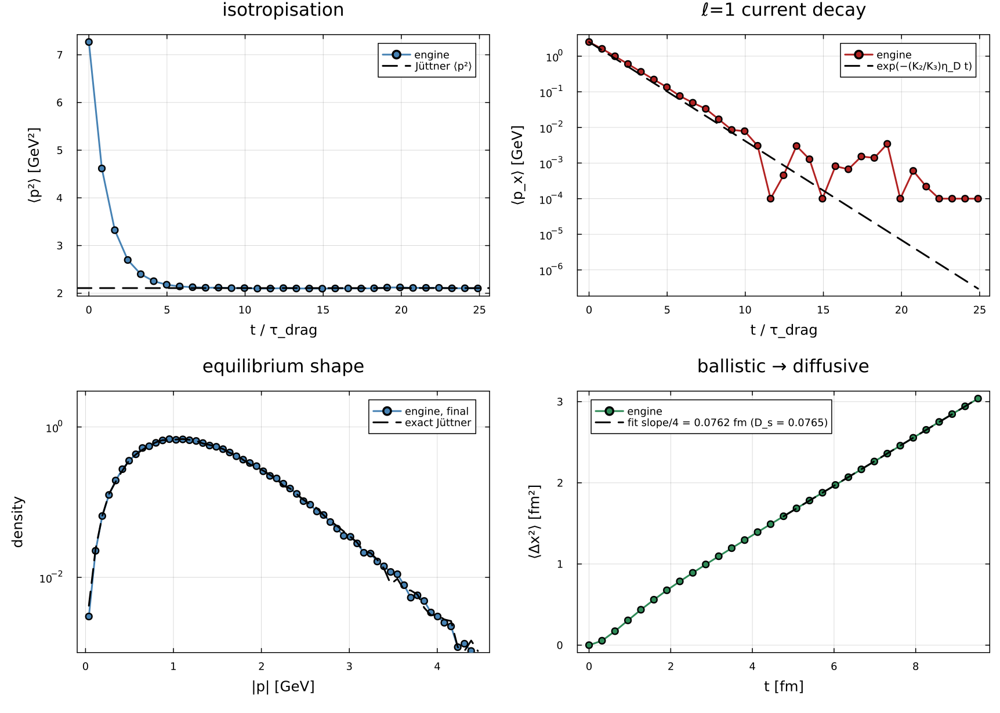
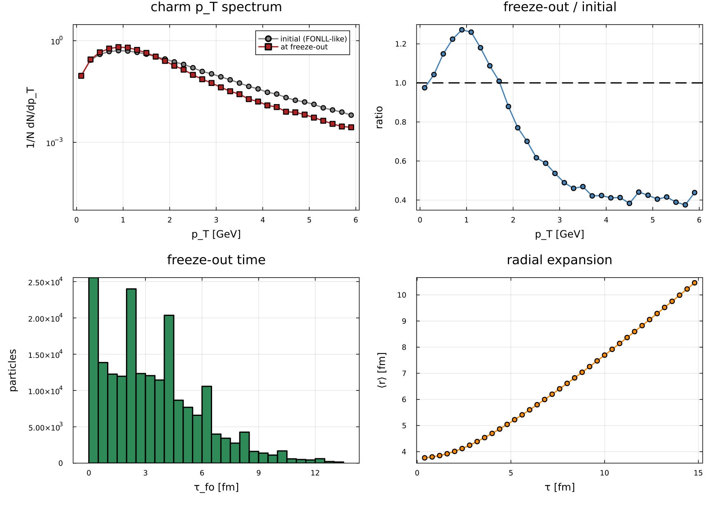
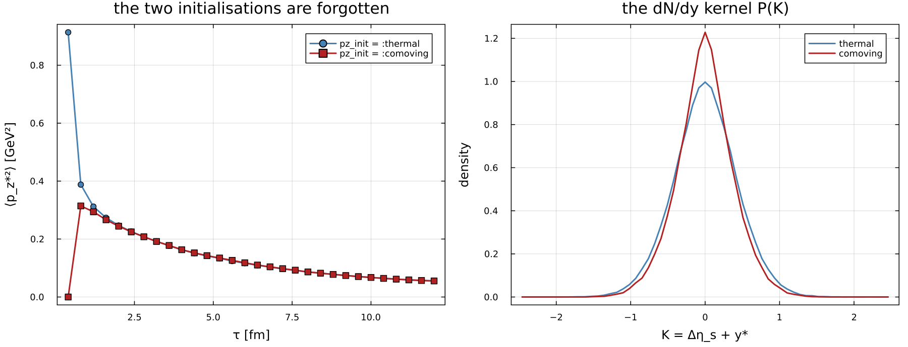
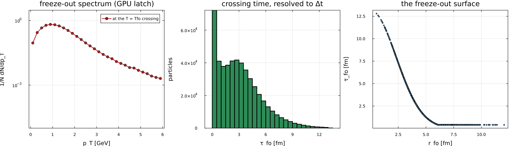
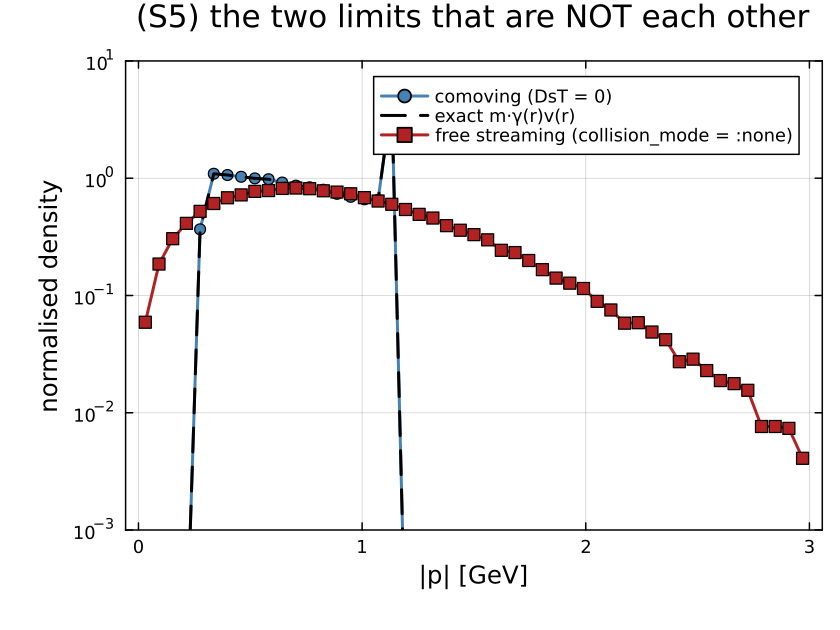
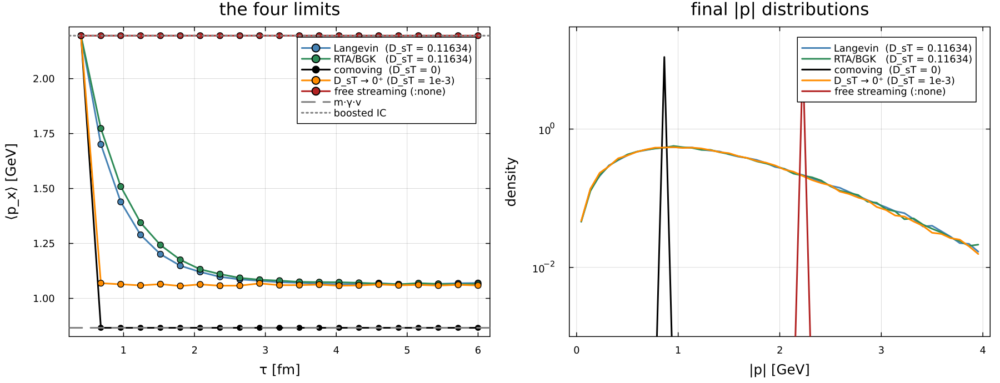
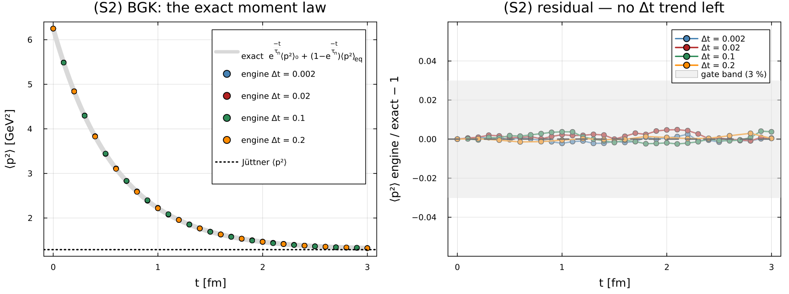
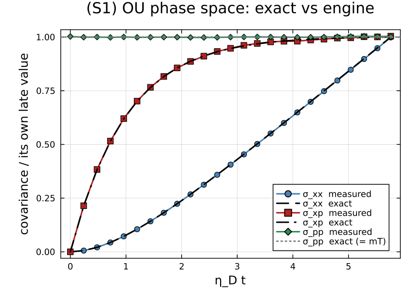

<h1 align="center">LangevInMedium.jl</h1>

<p align="center">
  <b>Relativistic Langevin dynamics of heavy quarks in an evolving medium.</b><br>
  <sub>Exact Ornstein–Uhlenbeck propagator · CPU and CUDA · validated against closed forms, not against itself.</sub>
</p>

<p align="center">
  
  
  
  
  
</p>

<p align="center">
  
</p>
<p align="center">
  <sub>
    <b>Everything above is produced by one 139-line example</b> (<a href="examples/01_uniform_bath.jl"><code>examples/01_uniform_bath.jl</code></a>)
    and every dashed line is a closed form, not a fit: the Jüttner ⟨p²⟩, the ℓ=1 decay rate
    <code>(K₂/K₃)·η_D</code>, the exact Jüttner momentum distribution, and <code>D_s = D_sT/T·ħc</code>
    from the mean-square displacement (measured −0.45 %).
  </sub>
</p>

---

## What it computes

An ensemble of heavy quarks on a tabulated hydrodynamic background `T(r, τ)`, `v_r(r, τ)`. Each
step boosts every particle into the **local fluid rest frame**, applies the **exact
Ornstein–Uhlenbeck propagator** for the drag with the matching Einstein noise, boosts back, and
streams the positions:

```
p*(t+Δt) = a·p*(t) + √(κ (1−a²)/(2η_eff)) · ξ ,     a = e^{−η_eff Δt} ,   ξ ~ N(0, 1)

   η_D = 1/τ_drag ,   τ_drag = m·D_sT/T²  (Einstein)      κ = 2 m T η_D  (fluctuation–dissipation)
   η_eff = η_D·m/E*   (relativistic ⇒ Jüttner equilibrium)     dx/dt = p/E
```

The propagator is the exact OU solution, not an Euler step, so there is no stability limit on `Δt`.
⚠ That it realises the stationary variance **at any Δt** is the *Galilean* statement
(`relativistic = false`, where `η_eff` is momentum-independent). With `relativistic = true` the
drag carries the particle's own energy, `η_eff = η_D·m/E*`, and the step is exact only at *frozen*
`E` — `E` is re-read at the start of each step while the true process changes it during the step.
That is precisely where the pre-point O(ηΔt) bias comes from, and
[`bench/bench_accuracy.jl`](bench/bench_accuracy.jl) measures it: `≈ 12.0 %·(η_DΔt)^0.94`.

One free coefficient goes in (`D_sT`) and **both** hydrodynamic coefficients come out: the
Navier–Stokes `D_s`, and the Israel–Stewart current time `τ_n = τ_drag·K₃/K₂` as a *derived*
consequence, not a second input.

The same algorithm runs on the CPU (bit-reproducible under `Random.seed!`) and on CUDA, and the two
backends are pinned against each other **per particle at 1e-12**, not through an ensemble moment.

## Install

The package is used from a monorepo environment; it is not registered.

```julia
julia --project=Julia            # the environment that has CUDA, Plots, QuadGK, Bessels…
```

```julia
using CUDA               # optional — attaches the GPU backend via Requires.jl
using LangevInMedium
```

## Quick start

```julia
using LangevInMedium, Random

# 1. a background: T_field[i, j] = T(xgrid[i], tgrid[j]) in GeV, v_field the radial flow in units of c
xgrid = collect(range(0.0, 26.0; length = 209))
tgrid = collect(0.4:0.05:15.0)
T_field = [max(0.05, 0.50 * (0.4/τ)^(1/3) * exp(-r^2/32)) for r in xgrid, τ in tgrid]
v_field = [0.65 * tanh(r/4) * min(1.0, τ/2)              for r in xgrid, τ in tgrid]

# 2. an initial phase-space density f[p_index, r_index] on UNIFORM (r_grid, p_grid)
r_grid  = collect(range(0.0, 20.0; length = 150))
p_grid  = collect(range(0.0, 10.0; length = 300))
density = [(1 + (p/2.1)^2)^(-3.1) * exp(-r^2/18) for p in p_grid, r in r_grid]

# 3. run
Random.seed!(1)
t, mom, pos = simulate_ensemble_bulk(CPUBackend(), r_grid, p_grid, density,
    T_field, v_field, (xgrid, tgrid);
    N_particles = 100_000, Δt = 5e-3,
    initial_time = 0.4, final_time = 15.0, save_interval = 0.5,
    m = 1.5, DsT = 0.11634,
    dimensions = 2,                 # positions: the transverse plane
    momentum_dimensions = 3,        # momenta: THREE rows (see "conventions" below)
    bjorken_redshift  = true,       # dp_z/dτ = −p_z/τ between kicks
    proper_time_kicks = true)       # kick per the particle's proper time, not the lab step

# mom[k] :: (momentum rows, N) at t[k];   pos[k] :: (dimensions, N)
```

Swap `CPUBackend()` for `GPUBackend()` and nothing else changes.

## Tutorial: read the examples in order

[`examples/`](examples) holds five runnable setups, smallest first. Each prints measured numbers
**next to the closed form or expectation they should match**, and writes its figure. Start at 01
and stop when you have what you need.

```sh
julia --project=Julia Julia/LangevInMedium.jl/examples/01_uniform_bath.jl
LIM_NOPLOT=1 julia --project=Julia .../examples/03_four_limits.jl     # numbers only, no Plots
```

| | setup | what you learn |
|---|---|---|
| [**01**](examples/01_uniform_bath.jl) `uniform_bath` | a box at fixed `T`, no flow, a δ-function initial momentum | what `D_sT` actually sets; that ⟨p²⟩ → the Jüttner value, the current decays at `(K₂/K₃)η_D`, and the MSD slope is `2·d·D_s`. **Everything here has a closed form** — if the engine breaks, it breaks here first |
| [**02**](examples/02_bjorken_fireball.jl) `bjorken_fireball` | a cooling, expanding fireball; the engine samples a FONLL-shaped density; freeze-out off the snapshots | the production shape of a real run, and the radial flow lifting the `p_T` spectrum (⟨p_T⟩ 1.586 → 1.318 GeV) |
| [**03**](examples/03_four_limits.jl) `four_limits` | `:langevin`, `:rta`, `DsT = 0`, `DsT → 0⁺`, `:none` on one background | **read this one.** Three of those five were confused with each other in production code. See below |
| [**04**](examples/04_pz_and_rapidity.jl) `pz_and_rapidity` | `momentum_dimensions = 3`, both `pz_init` modes, `track_eta_s` | what row 3 *means* (`p_z* = m_T sinh(y − η_s)`, not a lab `p_z`), and the kernel that makes `dN/dy = ρ(η_s) ⊛ P(K)` exact |
| [**05**](examples/05_gpu_freezeout.jl) `gpu_freezeout` | the GPU path with `freezeout_capture` | the production pattern: memory ∝ `N` instead of `N·(saves+1)`, the crossing resolved to `Δt`, and the fact that the run does **not** stop at freeze-out |

<table>
<tr>
<td width="25%"><a href="examples/02_bjorken_fireball.jl"></a><br><sub><b>02</b> a heavy-ion run: the radial flow lifting the charm p_T spectrum, the freeze-out time distribution, the radial expansion</sub></td>
<td width="25%"><a href="examples/04_pz_and_rapidity.jl"></a><br><sub><b>04</b> the two p_z* initialisations being forgotten, and the dN/dy kernel P(K) they leave behind</sub></td>
<td width="25%"><a href="examples/05_gpu_freezeout.jl"></a><br><sub><b>05</b> the GPU freeze-out latch: spectrum, crossing time resolved to Δt, and the freeze-out surface</sub></td>
<td width="25%"><a href="bench/bench_semianalytic.jl"></a><br><sub><b>S5</b> the comoving blast wave against free streaming — two limits that are <i>not</i> each other</sub></td>
</tr>
</table>

### The example that exists because of a real bug

<p align="center">
  
</p>

`D_sT = 0` is **not** free streaming — it is the *comoving* limit, every quark handed `p = m·γ(r)v(r)`
with **no thermal width at all** (the black spike). `D_sT → 0⁺` is a *third* thing: it thermalises
*with* the fluid and keeps the full Jüttner width, landing ~20 % higher in ⟨p_x⟩ (orange). Free
streaming is `collision_mode = :none` (red spike), and until v0.2.3 the only thing that actually
free-streamed was a *negative* `D_sT`, by accident. Three places in the parent repository — including
a driver that produced a figure — asked for `D_sT = 0` and called the result "free streaming".

## Validation

The engine is checked against **closed forms**, not against other implementations of the same
formula. Two suites, 27 gates, all passing:

```sh
julia --project=Julia Julia/LangevInMedium.jl/bench/bench_semianalytic.jl   # 9 gates, with plots
julia --project=Julia Julia/LangevInMedium.jl/bench/bench_physics_gates.jl  # 18 gates, physical units
```

<p align="center">
  
</p>

In a uniform bath a BGK particle either has not collided (probability `e^{−t/τ_n}`, so it still
carries its initial momentum) or has, and is then equilibrium-distributed. So for **any** observable

```
⟨g⟩(t) = e^{−t/τ_n}·⟨g⟩₀ + (1 − e^{−t/τ_n})·⟨g⟩_eq        exact, at all t
```

Four step sizes spanning 100× collapse onto that curve with no residual Δt trend. This is also the
gate on the v0.2.3 fix that made the per-step collision probability `−expm1(−Δt/τ_n)` instead of the
linearised `Δt/τ_n`: with the old form the `Δt = 0.2` curve was a visibly wrong exponential (the
realised rate was 22 % too fast).

| gate | target | measured |
|---|---|---|
| Uhlenbeck–Ornstein covariance | `σ_pp = mT`, `σ_xx = 2(T/m)/η²(ηt−1+e^{−ηt})`, `σ_xp = (T/η)(1−e^{−ηt})` | 0.40 % / 0.21 % / **0.54 %** worst |
| exact BGK moment law | the whole `⟨p²⟩(t)` curve, Δt spanning 100× | 0.5 % worst, no Δt trend |
| Bjorken redshift | `⟨p_z*²⟩ ∝ 1/τ²` telescopes | **2.9e-13** |
| free streaming + redshift | per-particle closed form for `x_⊥(τ)` | converges at order **1.00** |
| equilibrium **shape** | two-sample KS vs the exact Jüttner, 2 and 3 rows | 0.0019 / 0.0039 (95 % critical 0.0043) |
| comoving blast wave | `p = m·γ(r)v(r)`, **per particle** | one-step lag, order **1.00** |
| MSD slope | `2·d·D_s` at three `z` | 0.9896 / 0.9956 / 0.9975 |
| ℓ=1 rate | `η_D·K₂/K₃` (3 rows), `λ₁(2D)·η_D` (2 rows) | 0.6364 vs 0.6403 · 0.6952 vs 0.6977 |

`σ_xp` is the sharp one: it is built from the momentum update and the position update *together*,
so an operator-split error shows there while `σ_pp` and `σ_xx` can each look right on their own.

<p align="center">
  
</p>

### How wrong is it at a given Δt?

[`bench/bench_accuracy.jl`](bench/bench_accuracy.jl) turns a required accuracy into a required step
size. The pre-point relativistic drag gives an O(ηΔt) bias on ⟨p²⟩; measured, with the Galilean
branch as an unbiased-measurement control:

```
|⟨p²⟩ bias| ≈ 12.0 % · (η_D Δt)^0.94      ⇒  0.046 % at the production η_D Δt ≈ 2.6·10⁻³
D_s is unbiased to ≲1 % for η_D Δt ≤ 0.08
```

## Three conventions that bite

**1. One transport coefficient, not two.**

`tau_drag(T, m, DsT) = m·DsT/T²` is what the kernel uses (`η_D = 1/τ_drag`, `κ = 2mT/τ_drag`).
`tau_n_main3(T, m, DsT) = D_s·z·K₃/K₂` is the **diffusion-current** relaxation time — the
Israel–Stewart τ_n that Fluidum's `τ_diffusion_hadron` evaluates. For a Fokker–Planck process
with drag η_D the ℓ=1 mode decays at `η_D·K₂/K₃` (an exact 3-D identity), so a Langevin built
from `tau_drag` reproduces **both** hydro coefficients, D_s and τ_n. Building the drag from
`tau_n_main3` applies K₃/K₂ once too often and inflates the realised D_s by 1.26–1.74× — that
was the state of every product before 2026-08-02. The BGK (`:rta`) path needs τ_n, not the drag
(`build_taun_current_spline`). `test/runtests.jl` guards the ratio pointwise.

`LV_TAUN_SCALE` (env var, default 1) rescales **both** splines — diagnostic only; it moves D_s
too. The bench suite refuses to run under any other value.

**2. `dimensions` sets the positions; `momentum_dimensions` sets the momenta.**
A 2-D momentum run relaxes to the 2-D Jüttner, whose ℓ=1 rate differs from the 3-D `K₂/K₃·η_D` by
**5–12 %** over `z = 3.5–10` — and the hydrodynamic coefficients are matched in the 3-D theory.
`dimensions = 2, momentum_dimensions = 3` is the combination that removes that offset: three
momentum components on a two-dimensional transverse plane.

**3. `D_sT = 0`, `D_sT → 0⁺` and `:none` are three different limits.** See the figure above.
`m ≤ 0` and `D_sT < 0` are refused since v0.2.3 — before that they degraded *silently* to free
streaming, producing a run indistinguishable from a Langevin run except by its numbers.


## CPU vs GPU

Same algorithm, same kwargs, same return shape. The CPU path is bit-reproducible under
`Random.seed!`; the GPU draws from CURAND and is reproducible in ensemble moments only. The
host does the sampling and the p_z completion on both paths, so the t0 snapshot is identical
to float rounding (the parity bench checks it). The GPU interpolant, boosts and T-guards mirror
the CPU's clamps since 0.2.0 — a particle leaving the table or a `|v| > 1` cell used to NaN the
whole GPU ensemble.

## Tests and benchmarks

```
LIM_FAST=1 julia --project=Julia Julia/LangevInMedium.jl/test/runtests.jl    # transport + unit + time-convention (≈30 s)
           julia --project=Julia Julia/LangevInMedium.jl/test/runtests.jl    # + relativistic switch, momentum_dims3, CPU/GPU kernel parity, GPU-only paths (≈10 min, GPU halves if CUDA works)
           julia --project=Julia Julia/LangevInMedium.jl/test/regression_corpus.jl   # bit-identity vs the committed baseline (CPU hashes, GPU moments)
```

**CPU ↔ GPU is pinned deterministically, not statistically.** `test_kernel_parity.jl` drives each
kernel pair with the same inputs *and the same injected noise arrays* (the GPU kernels take their
randomness pre-generated), so the two backends are compared per particle at 1e-12 or tighter
instead of through a 3 % ensemble moment. Exact equality is not attainable and is not asked for:
the device contracts multiply-adds into FMA and the host does not, so any expression with a
multiply-add differs by an ulp by construction. Measured agreement: the interpolant and the spline
evaluator sub-ulp in range, the boosts 1–2 ulps, the force kernel ≈1.6e-14 relative to each term's
own scale. Two divergences are deliberate and recorded there rather than reconciled (see
`@testset "D1"`).

`test/regression_corpus_baseline.txt` holds SHA-256 hashes of ten seeded runs spanning the
kwarg surface (Galilean, p_z + redshift, DsT_quad/linear, RTA, position diffusion, both sampler
modes, radial mode). A change that keeps the default dynamics must reproduce every hash;
regenerate with `LIM_CORPUS_WRITE=1` **only** for a deliberate change and say so in the CHANGELOG.
Regenerated once, at 0.2.3, for the four cases the FONLL-trapezoid and RTA-`expm1` fixes move
(`sampler_cart`, `sampler_polar`, `radial_dim1`, `rta_flow`); the other six reproduced and that is
what says the fixes are scoped to the sampler and the BGK step and nothing else.
Its GPU half is a *statistical* check and its ⟨p_x⟩ gate is a ~2σ test against a single seeded CPU
draw, so it fails roughly one run in twenty on that field alone (CHANGELOG 0.2.1) — the CPU hashes
are the deterministic part, and `LIM_CORPUS_NOGPU=1` runs only those.


The engine is wired into the repo gate as `programme.jl check` → `engine`
(`Julia/Projects/test_langevinmedium_engine.jl`), which runs the deterministic half only:
`LIM_FAST=1 runtests.jl` plus the CPU bit-identity corpus.

`bench/` (results in `bench/results/`):

| script | what it pins |
|---|---|
| `bench_physics_gates.jl` | quantities in physical units the engine cannot fake: MSD slope = 2·d·D_s at three z (CPU and GPU); the Jüttner tail p > 3 GeV at the Poisson floor; the ℓ=1 rate = λ₁η_D for 3 and 2 momentum rows; Δt bias of the propagator (none for Galilean, ≤ 1.5 % at ηΔt ≤ 0.1 relativistic); the Galilean MSD(t) curve at all t; `DsT_quad` ⇒ T-independent drag |
| `bench_gpu_parity.jl` | CPU ↔ GPU **moments** on four nominal backgrounds and on the adversarial inputs (outside the table, `\|v\| > 1` cell) that separated them before 0.2.0, plus a `freezeout_capture` self-consistency case. The *exact* backend comparison is `test/test_kernel_parity.jl`; this one asks the different question "do two full runs with different RNG streams land in the same place" |
| `bench_semianalytic.jl` | the engine against CLOSED FORMS, with plots: the full Uhlenbeck–Ornstein phase-space covariance including the `σ_xp` cross-correlation nothing else tests; the exact BGK moment law `⟨g⟩(t) = e^{−t/τ_n}⟨g⟩₀ + (1−e^{−t/τ_n})⟨g⟩_eq` at four Δt spanning 100×; free streaming with the Bjorken redshift against its closed form (and the scheme's measured first order); the equilibrium *shape* by two-sample KS in 2 and 3 momentum rows; the comoving blast wave checked PER PARTICLE. Figures in `bench/results/figures/` |
| `bench_accuracy.jl` | the Δt accuracy budget: `\|⟨p²⟩ bias\| ≈ 12.0 %·(ηΔt)^0.94`, the Galilean branch as an unbiased-measurement control, `D_s` unbiased to ≲1 % for ηΔt ≤ 0.08, and the RTA Δt ceilings. Accuracy, not speed — valid on a loaded machine |
| `bench_throughput.jl` | marginal ns per particle-step and fixed per-call overhead for CPU/GPU × N × momentum rows × relativistic × collision mode, plus the host-side phases (sampler, `randn!`, copies) |

All of them end in a top-level `[PASS]`/`[FAIL]` line and a non-zero exit on failure.

## Reference

<details>
<summary><b>The entry point and the full keyword surface</b> (click to expand)</summary>

### The one entry point

`simulate_ensemble_bulk(backend, …)` dispatches on the backend singleton:

| method | what it does |
|---|---|
| `(CPUBackend(), r_grid, p_grid, f, T_field, v_field, (xgrid, tgrid); kw...)` | the workhorse, ≈35 call sites in `Projects/` |
| `(GPUBackend(), …same…; kw...)` | CUDA twin; exists only after `using CUDA` |
| `(CPUBackend(), T::Float64; kw...)` | homogeneous box, momenta only (toy: fixed `κ = 2.5T³`, ignores `DsT`) |

Returns `(time_points, momenta_snapshots, position_snapshots)`. `?simulate_ensemble_bulk` has
the full keyword table; the ones that decide the physics:

| keyword | default | meaning |
|---|---|---|
| `m`, `DsT` | 1.0, 0.2 | quark mass [GeV]; `D_s·T` label. The drag is the Einstein relation `1/η_D = tau_drag = m·DsT/T²` |
| `DsT_linear, DsT_slope, DsT_offset, Tfo` | off | `DsT(T) = slope·max(T, Tfo) + offset` |
| `DsT_quad, DsT_Tref` | off | `DsT(T) = DsT·(T/Tref)²` ⇒ a T-independent drag time (the uniform-drag member; the Galilean solvable class closes only here) |
| `dimensions` | 3 (**pass 2**) | 2 = transverse plane (x, y); 1 = radial mode (r, p_r) |
| `momentum_dimensions` | 0 (= `dimensions`) | 3 with `dimensions = 2`: a longitudinal `p_z` row (thermal conditional at t0). 2-D momenta relax to the 2-D Jüttner, whose current rate λ₁η_D differs from the 3-D `K₂/K₃·η_D` by 5–12 % over z = 3.5–10 |
| `bjorken_redshift` | false | `dp_z/dτ = −p_z/τ` between kicks (needs `momentum_dimensions = 3`, `initial_time > 0`) |
| `relativistic` | true | true: Jüttner kinematics — drag `η_D·m/E`, streaming `p/E`, Lorentz boosts. false: the exactly solvable **Galilean** process — drag `η_D`, streaming `p/m`, boosts `p∥ ∓ m·v` |
| `collision_mode` | `:langevin` | `:rta`: BGK re-draw from the local Jüttner with probability `1 − e^{−Δt/τ_n}`, τ_n the **current** time `tau_n_main3`. `:none`: FREE STREAMING — no drag, no noise, no frame change (the Bjorken redshift still applies). ⚠ `:none` is the only way to ask for free streaming; `DsT = 0` is the *comoving* limit |
| `x_init, p_init` | sampler | `(2, N)` lab positions and **rest-frame** momenta (the t0 lab boost is applied inside) |
| `cartesian_spatial_sampling`, `antithetic_momenta` | auto, false | sampler mode (disc rejection vs polar inverse-CDF); (p, −p) pairs |
| `position_diffusion`, `reflecting_boundary` | false | extra overdamped position kicks (double-counts vs hydro); reflect at `r = xgrid[end]` |
| `momentum_langevin` | true | false (or `DsT = 0`): particles glued to the flow, `p = m·γ·v`, with every momentum row beyond the spatial ones set to zero |
| `V2Evolutionn, psi2` | — | elliptic modulation `v → v(1 + 2v₂cos 2(φ−Ψ₂))` |
| GPU only: `freezeout_capture, freezeout_interp` | false | latch each particle's `T = Tfo` crossing; returns a NamedTuple `(pos, mom, tau, flag)` instead of histories. The run does **not** stop at freeze-out |
| GPU only: `integrator_mode` | 0 | 1 = drift-midpoint drag. 🔴 **Measured to roughly DOUBLE the Δt bias it was meant to remove** — see "Known biases" below. The CPU refuses 1 |
| GPU only: `verbose` | false | print device + memory status at entry |

</details>

<details>
<summary><b>Known biases, limits, and the defect ledger</b> — every one measured, dated and gated (click to expand)</summary>

### Known biases and limits

- **Pre-point relativistic drag**: `η_D·m/E` is evaluated at the start of the step ⇒ an O(ηΔt)
  bias on ⟨p²⟩, ≈ −1 % at ηΔt = 0.1 and below resolution at production ηΔt ≈ 3·10⁻³. The
  Galilean propagator is exact at any Δt.
- 🔴 **`integrator_mode = 1` makes that bias WORSE, not better** (measured 2026-08-31, N = 10⁶,
  SEM 0.14 %, uniform bath against the 2-D Jüttner ⟨p²⟩):

  | ηΔt | mode 0 | mode 1 | ratio |
  |---|---|---|---|
  | 0.05 | −1.03 % | −1.74 % | 1.70 |
  | 0.10 | −1.36 % | −3.49 % | 2.57 |
  | 0.20 | −3.23 % | −6.53 % | 2.02 |
  | 0.30 | −4.26 % | −9.19 % | 2.16 |

  Same sign, roughly double, and still linear in Δt — so it is O(ε), not the advertised O(ε²).
  The predictor is a *noise-free* drag half-step `p_mid = e^{−η_eff Δt/2}·p`, which can only shrink
  |p|; so `E_mid < E` always and the midpoint drag is always *larger* than the pre-point one. A
  genuine midpoint would have the noise raising ⟨p²⟩ as much as the drag lowers it — that is what
  stationarity means — so the correct midpoint energy is ≈ the pre-point one. Dropping the noise
  (deliberately, to stop `η_eff` correlating with ξ) trades a correlation error for a one-sided
  drift of the same order and sign as the error it targets. **No product is affected**: every
  driver maps its `integrator` option with `== "mid" ? 1 : 0` and no recipe passes `"mid"`.
  Gated in `test_gpu_only_paths.jl` `@testset "F5"`; not fixed, because a fix changes what mode 1
  computes.
- 🔴 **`eval_tau_n_spline` extrapolates outside its table** and can return a NEGATIVE time, which
  every kernel reads as `η_D = κ = 0` — silent free streaming with neither drag nor noise. Not
  reachable through the drivers (they span the spline over the whole `T` table and the background
  interpolant clamps into it); reachable by any external caller, and this function is exported.
  Full account, measurements and the one-line fix in its docstring; gated with `@test_broken` in
  `test_kernel_units.jl` `@testset "U2"`.
- **The boosts are not exactly Lorentz**: `γ = 1/√(1 − v² + 1e-10)`. The regularisation biases γ
  low by ≈ ½·1e-10/(1−v²) (1.4e-10 at v = 0.8), and because `γ²(1−v²) ≠ 1` the lab→LRF→lab round
  trip is not an involution — it contracts momenta by ≈ 1e-10/(1−v²) per step, ≈ 9e-7 over a
  5 800-step run at v = 0.6. It also overrides the `|v| ≤ √(1−1e-12)` clamp, capping γ at ≈1e5
  rather than 1e6. Pinned in `test_kernel_units.jl` `@testset "U3b"`/`"U3c"`.
- **2-D momenta** relax to the 2-D Jüttner; compare against 3-D hydro coefficients with
  `momentum_dimensions = 3` or budget the 5–12 % λ₁ offset.
- **`save_interval` should divide the evolution**; otherwise the trailing steps are not in the
  history (the returned `time_points` are the true snapshot times; a warning says how much was dropped).
- A background table with `T ≤ 0` anywhere is refused by the spline builder on both backends.
- The FONLL sampler's acceptance in `cartesian_spatial_sampling = true` mode is the fireball's
  area fraction of the disc — a few % for Pb+Pb in a 20 fm disc; it is host-side and serial.
- GPU: the methods exist only after `using CUDA` (Requires.jl, not precompiled); `:rta` and
  `:langevin` only; the momentum history for `N·(saves+1)` lives on the device until the end.

#### The LIMITS and the INPUT CONTRACT (found 2026-09-02, all FIXED in 0.2.3)

The 0.2.1 audit covered every function and 0.2.2 the p_z frame. Neither asked what the engine does
when it is asked for a *limit*, or handed an input outside its assumptions. Seven defects came out
of that question. All are fixed; each is gated in `test/test_limits_and_contracts.jl` (41 assertions)
with the pre-fix measurement in the comment, so a regression has something specific to fail against.
⚠ **Three of the seven move numbers** — see "What regenerates" below.

- 🔴🔴 **`sample_particles_from_FONLL` assumed a UNIFORM grid, and was FIRST ORDER even there.**
  Its inverse CDF was `cumsum(w) * mean(diff(grid))` — a right-Riemann sum with one constant
  spacing. Now a cumulative trapezoid on the actual nodes (`Utils._cumtrapz`). Against the exact
  ⟨p⟩ of `P(p) ∝ p·f(p)` on the same range, FONLL-like `(1+(p/2.1)²)^(−3.1)`, 12 independent seeds:

  | p grid over [0, 10] | before | after |
  |---|---|---|
  | uniform, np = 100 | −3.14 % | −0.01 ± 0.05 % |
  | uniform, np = **300 (production)** | **−1.08 %** | **−0.08 ± 0.05 %** |
  | uniform, np = 1200 | −0.29 % | −0.09 ± 0.05 % |
  | log-spaced, 300 | **−44.6 %** | −0.07 ± 0.05 % |

  Two separate errors were in there. On a uniform grid the old rule converged (O(Δp)), so the
  production np = 300 cost ≈ −1 % on ⟨p_T⟩ and −1 % on ⟨p_T²⟩ of every FONLL initial condition —
  partly cancelling in a ratio carrying the same IC top and bottom. On a NON-uniform grid it was
  simply the wrong quadrature and refinement did not help (−25.7 % at 160 log-spaced points, still
  −24.7 % at 1600). The residual is now grid-INDEPENDENT, which is the signature that the
  quadrature is right, and sits at the measurement's own resolution.
- 🔴 **The glued-to-the-flow limit forgot the `p_z` row.** `kernel_set_to_fluid_velocity_*` wrote
  momentum rows 1–2 only, on both backends, so with `momentum_dimensions = 3` row 3 kept whatever
  the IC put there and still entered `E = √(m² + p_⊥² + p_z*²)`: the particle that is supposed to
  *be* the fluid element streamed slower than it. Measured at v = 0.5, T = 0.30, τ ∈ [0.4, 2.4]:
  ⟨v_x⟩ = **0.4645 against the fluid's 0.5000, −7.10 %** (CPU and GPU to six digits), ⟨p_z*²⟩ =
  0.596 GeV² alive at the end. Both kernels now zero every row beyond the spatial ones — the fluid
  is longitudinally comoving in Milne by construction. Measured after: **0.500000, deficit 0.0000 %,
  ⟨p_z*²⟩ = 0**. The old gate could not see it: `test_momentum_dims3.jl` "(R)" uses a ZERO-flow box.
- 🔴 **`D_sT` had three limits and no way to name the third.** `DsT == 0.0` branches into the glue
  kernel: `p = m·γ·v`, the **cold comoving** limit (measured 0.86603 = m·γ·v exactly). `DsT → 0⁺` is
  a *different* limit — thermal comoving, ⟨p_x⟩ = γv⟨E*⟩ = **1.0350**, 19.5 % higher. Free streaming
  was neither, and was reachable only through a **negative** `DsT`, by accident. Three places in the
  tree called `DsT = 0` "free streaming" (this README's trap list, `CLAUDE.md`,
  `Projects/SpectraDiagnostic/plot_dst_sweep.jl`, and `AttractorPaper5/Code/run_langevin_kompost.jl`,
  which *ran* it and labelled the curve). Now **`collision_mode = :none` is free streaming**, on both
  backends: no drag, no noise, and no boost pair either, so the momenta are exactly constant (the
  only residue is the documented γ regularisation in the single t0 lab boost, 6.7e-11 at v = 0.5).
  The Bjorken redshift still applies under `:none`, being the longitudinal free-streaming law.
- 🔴 **`m ≤ 0` and `DsT < 0` degraded SILENTLY to free streaming** — `tau_drag` returns 0.0 for any
  non-positive argument and every kernel reads `τ ≤ 0` as `η_D = κ = 0`, so a mistyped mass gave a
  free-streaming run indistinguishable from a Langevin run except by its numbers (measured: ⟨p²⟩
  frozen to 1e-9, nothing said). Both are now refused with a message that names the alternative.
  `DsT == 0` stays legal — it is the comoving limit, not an error.
- 🔴 **The background table was never checked against the requested window.** `interpolate_2d_*`
  clamps into the table — right for a particle at the rim, wrong for a run that outlives the hydro
  output: past `tgrid[end]` the medium froze at its last slice and the run continued, silently, on
  both backends. The clamping is KEPT (it is occasionally deliberate) and is now announced, by two
  once-per-run warnings: the window check at entry, and an escaped-particle count at exit
  (measured: on a table cut at r = 8 fm, **16.2 %** of a 20 000-particle ensemble finished outside
  it, out to r = 15.2 fm, dragged at the rim `T` and `v` the whole way). Neither carries `maxlog`,
  deliberately: `maxlog` is keyed by source location, so it would silence every call after the
  first in a campaign that drives the engine many times — exactly the silence they exist to break.
- **The step count is no longer `floor`ed on a quotient that is not exactly representable.**
  `1.4 − 0.4 = 0.9999999999999999`, so `q = 999.9999999999999` and a whole step was lost. Usually
  10⁻³ fm; the damage was that it also broke `steps % save_every == 0`, and `_snapshot_times` then
  dropped the entire trailing save interval and blamed `save_interval` for "not dividing the
  evolution". Measured worst case: t0 = 0.4, tf = 1.4, Δt = 10⁻³, `save_interval` = 0.5 kept **501
  of 1000 steps — half the requested history**. `_step_count` snaps within 64 ulps of the quotient,
  which is ~4 orders above any representation error and ~3 below any shortfall a caller could mean
  (gated both ways).
- **The RTA/BGK collision probability is exponential**, `−expm1(−Δt·dil/τ_n)`, not the linearised
  `Δt/τ_n`. The old form made the survival probability `1 − Δt/τ_n` and the realised rate
  `−ln(1 − Δt/τ_n)/Δt`: always too fast. Measured ratio to the nominal `1/τ_n` at
  Δt = 0.002 / 0.01 / 0.05 / 0.1 / 0.2 (τ_n = 0.5976 fm):

  | | 0.002 | 0.01 | 0.05 | 0.1 | 0.2 |
  |---|---|---|---|---|---|
  | before | 1.0013 | 1.0069 | 1.0517 | 1.0936 | **1.2198** |
  | after | 1.0049 | 1.0070 | 0.9970 | 1.0014 | **1.0006** |

  The Δt-dependence is gone (the residual ±0.5 % is the ensemble's own noise at N = 2·10⁵), and with
  it the step-size ceiling the RTA used to carry.
- Two things checked and found **correct**, pinned so a later change has something to fail against:
  `reflecting_boundary` preserves the uniform disc measure (⟨r⟩ and ⟨r²⟩ within 0.11 % over 20 fm,
  no escapes), and `track_eta_s` is an exact passenger (momenta and positions bit-identical with it
  on and off, max |Δ| = **0.000e+00**). The 0.2.1 hot-loop rewrite has held: **0 bytes per
  particle-step** across CPU × N ∈ {2·10⁴, 10⁵} × pdim ∈ {2, 3} × {`:langevin`, `:rta`}.

#### What regenerates

The corpus says it precisely: **6 of the 10 CPU hashes are unchanged**, and the 4 that moved are
exactly `sampler_cart`, `sampler_polar`, `radial_dim1` (the trapezoid) and `rta_flow` (the
exponential). Nothing leaked into the injected-particle (`x_init`/`p_init`) Langevin path. So:

| fix | what it touches | who |
|---|---|---|
| FONLL trapezoid | every run that lets the engine sample (`heavy_quark_density`, no `x_init`) | **LP1, O+O, AM, KA — every FONLL IC in the tree**; ⟨p_T⟩ of the IC moves ≈ +1 % |
| RTA `−expm1` | `collision_mode = :rta` only | LP1's two RTA cells; < 0.1 % at production Δt |
| step count | windows whose `(tf − t0)/Δt` was mis-floored | **AttractorHydro's portrait** (0.4 → 13.0 at Δt = 10⁻⁴): 125 999 → 126 000 steps, 1260 → 1261 snapshots. LP1's 12.6 fm and O+O's 7.6 fm divide exactly and are untouched |
| glue `p_z`, validation, warnings, `:none` | nothing in production | no driver passes `momentum_langevin = false`, `m ≤ 0` or `DsT < 0`; `:none` is new |

</details>

## Layout

```
src/LangevInMedium.jl     module docstring, includes, exports
src/constants.jl          ħc (PDG 0.197327 GeV·fm) and fmGeV
src/backends.jl           CPUBackend, GPUBackend
src/utils.jl              sample_particles_from_FONLL, the p_z completion (append_thermal_pz), check_momentum_dims
src/transport.jl          tau_drag, tau_n_main3, effective_DsT, the two spline builders, build_juttner_invcdf, LV_TAUN_SCALE
src/kernels_cpu.jl        per-step CPU kernels (boosts, forces, momentum/position updates, RTA, saves)
src/simulate_cpu.jl       CPU driver (+ _snapshot_times)
src/simulate.jl           public dispatch + the Requires hook
src/kernels_gpu.jl        CUDA kernels — line-for-line twins of the CPU ones (keep them in step; bench_gpu_parity.jl is the check)
src/simulate_gpu.jl       GPU driver (freeze-out capture, RTA inverse-CDF table)
src/simulate_gpu_wrapper.jl   the GPU method, included by the hook
examples/                 five runnable setups + example_common.jl (background builders) and a README
src/data/Fluidum_MIS_HQ.jld2  a Fluidum MIS background (23 MB) — NOT read by the package; FokkerPlank1D/2D, FiVoHydro/main2.jl and CompareBoltzmannHQ load it from here
test/                     runtests.jl (drives everything below), regression_corpus.jl (+ baseline)
  test_kernel_units.jl        every primitive against an independent construction (interpolant, spline
                              evaluator, both boosts, the two Jüttner samplers, FONLL fidelity, the box path)
  test_kernel_parity.jl       DETERMINISTIC CPU↔GPU, kernel by kernel, same injected noise, ≤1e-12
  test_gpu_only_paths.jl      freezeout_capture and integrator_mode = 1
  test_time_convention.jl     which step time each kernel reads the background at
  test_limits_and_contracts.jl the LIMITS (D_sT → 0, glued to the flow, free streaming) and the INPUT
                              CONTRACT (a table that ends before final_time, a non-uniform grid, m ≤ 0)
  test_relativistic_switch.jl, test_momentum_dims3.jl, test_proper_time_kicks.jl,
  test_rta_proper_time.jl, test_bjorken_redshift_exact.jl
bench/                    bench_common.jl, bench_semianalytic.jl (closed forms + plots), bench_accuracy.jl
                          (the Δt budget), bench_physics_gates.jl, bench_gpu_parity.jl, bench_throughput.jl,
                          results/ (+ results/figures/)
```

---

<sub>MIT licensed. The engine behind the LangevinPaper1 / O+O / AttractorMomentum /
AttractorHydro / KineticAttractor studies. Changes that move a number are recorded in
[`CHANGELOG.md`](CHANGELOG.md) with the measurement that found them.</sub>
